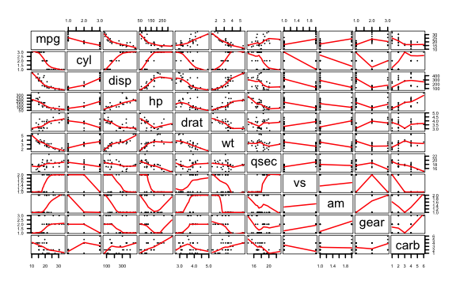
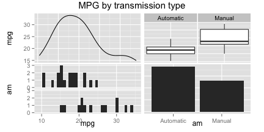
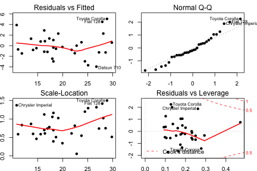

## Summary
In this report we explore the effects of manual and automatic transmission on the fuel efficiency (measured in terms of the definitely non-[SI](http://en.wikipedia.org/wiki/International_System_of_Units) unit _miles per gallon_) of a set of 32 automobile models from 1973-74. The data was extracted from the 1974 _Motor Trend_ US magazine, and is available from the R Package _datasets_ (version 3.1.2 was used in this work).  
The analysis of this data is composed of three parts: (i) _Exploratory Data Analysis_, in which the data is loaded, preprocessed, and subject to an initial graphical examination; (ii) _Regression Analysis_, in which a linear model is fit to the data. This part also contains discussions on model selection, validation (by residual analysis), and interpretation of the relevant regression coefficients; and (iii) _Appendix_, wherein the plots that are used to support the discussion throughout this report are presented.  
The results obtained for the available data show that vehicles with manual transmission present a higher average MPG value than the automatic models. This effect is not, however, statistically significant ($CI_{.95} = 1.81\pm 2.87$, $p = 0.206$).

## Exploratory Data Analysis
The first step is to load and preprocess the data:

```r
data(mtcars)
fc<-c(2,8:11)
for (i in 1:length(fc)){mtcars[,fc[i]]<-as.factor(mtcars[,fc[i]])}
levels(mtcars$am) <- c("Automatic","Manual")
```
To get an initial feel for the relationships between the variables - and, in particular, between **mpg** and **am** - it is interesting to observe the scatterplots produced by plotting each variable against all others, as well as the specific distribution of **mpg** values within each level of **am**. The plots are shown in the Appendix, figures 1 and 2.

Two facts are immediately clear from the plots: first, **mpg** tends to correlate well with many of the other variables, most intensely with **drat** (positively) and **wt** (negatively). It is also clear that many of the variables are highly correlated (e.g., **wt** and **disp**). Second, it seems like manual transmission models present larger values of **mpg** than the automatic ones. In the next section a linear model will be fit to the data in order to investigate the significance and magnitude of this possible effect.

## Regression Analysis
To obtain a parsimonious model for this particular data, the following approach will be employed: first, a model of **mpg** regressed on all other variables will be fit; then, an iterative pruning procedure based on removing terms from the model and evaluating the impact on the AIC^[[Akaike's Information Criterion](https://noppa.aalto.fi/noppa/kurssi/s-114.1310/luennot/extramaterial.pdf).] will be employed.

```r
fit1<-lm(mpg~.,data=mtcars)
fit2<-step(fit1,direction = "both",trace=0)
library(broom)  # Get it first using devtools::install_github("dgrtwo/broom")
tidy(fit2)      # Uses broom::tidy() function to provide a tidy summary table
```

```
##          term    estimate  std.error statistic      p.value
## 1 (Intercept) 33.70832390 2.60488618 12.940421 7.733392e-13
## 2        cyl6 -3.03134449 1.40728351 -2.154040 4.068272e-02
## 3        cyl8 -2.16367532 2.28425172 -0.947214 3.522509e-01
## 4          hp -0.03210943 0.01369257 -2.345025 2.693461e-02
## 5          wt -2.49682942 0.88558779 -2.819404 9.081408e-03
## 6    amManual  1.80921138 1.39630450  1.295714 2.064597e-01
```

Comparing the simplified model with the original one we see that the removal of the other predictors has not significantly affected the explanatory ability of the model.

```r
anova(fit1,fit2)
```

```
## Analysis of Variance Table
## 
## Model 1: mpg ~ cyl + disp + hp + drat + wt + qsec + vs + am + gear + carb
## Model 2: mpg ~ cyl + hp + wt + am
##   Res.Df    RSS  Df Sum of Sq      F Pr(>F)
## 1     15 120.40                            
## 2     26 151.03 -11   -30.623 0.3468 0.9588
```

### Interpretation 
The regression coefficient for the **am** factor (shown above as _amManual_) suggests that the expected value of **mpg** for vehicles with manual transmission is 1.809 larger than for that of automatic transmission models ^[According to the [course notes](http://bcaffo.github.io/courses/07_RegressionModels/02_02_multivariateExamples/#10), the regression coefficient for amManual "_is interpretted as the increase or decrease in the mean comparing those in the group to those not._".]. This effect, however, is not statistically significant at the 95% confidence level. The confidence interval for this coefficient can be easily obtained:

```r
confint(fit2, "amManual", level=0.95)
```

```
##              2.5 %   97.5 %
## amManual -1.060934 4.679356
```
Or, equivalently, we can express the difference in mean efficiency between manual and automatic models in the more familiar form of (1.81 $\pm$ 2.87) miles per gallon. Finally, the proportion of the variance that is explained by the model can be extracted using _summary(fit2)$r.squared_, which yields r^2^ = 0.8659. The final model explains about 87% of the total variance, which is quite reasonable.

### Residual analysis
To verify whether the assumption of i.i.d. Gaussian residuals is violated, a graphical examination of the residual plots is often suggested. These plots are shown in the Appendix, figure 3. From these plots we can infer two characteristics: (i) the residuals do appear to be approximately normal, but deviate from normality at the tails; and (ii) there does not seem to be any large violation of homoscedasticity. Given the linear model relative robustness to these two assumptions, it is safe to assume that the obtained model is relatively sound.

## Appendix: Plots
### Figure 1. Scatterplots produced by plotting each variable against all others

```r
pairs(mtcars,panel=panel.smooth, pch=16, cex=0.5, gap=0.25, lwd=2, las=1, cex.axis=0.7)
```

 

***

### Figure 2. MPG versus AM

```r
library(GGally,quietly = T, warn.conflicts = F) #Get it first using
                                                # install.packages("GGally")
ggpairs(data=mtcars,columns=c(1,9),title="MPG by transmission type",
        upper=list(combo="box"),lower=list(combo="facethist"),
        diag=list(continuous="density",discrete="bar"))
```

 

***

### Figure 3. Residual plots for the final model

```r
par(mfrow=c(2,2), mai=.3*c(1,1,1,1))
plot(fit2,pch=16,lty=1,lwd=2)
```

 
